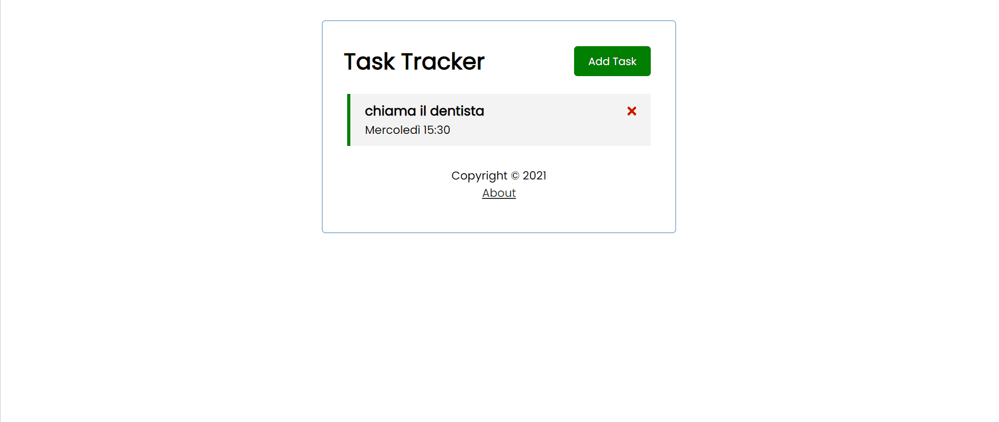

# vue-examples

In questa repository troverai alcune App realizzate con **Vue.js**

## vue-randomuser
Applicazione didattica ottenuta installando vue tramite `CDN`. 
L'app richiede un utente fake random da [https://randomuser.me](https://randomuser.me) che espone delle API pubbliche


### Caratteristiche:
- **Installazione di Vue tramite CDN**

## vue-qrcode

Applicazione completa utilizzando **Vue instance**. L'applicazione genera un qrcode a partire da un campo di testo e consente di scaricare il qr code in due diversi formati.


### Caratteristiche:
- **Vue instance**

### Installazione e utilizzo
- Installa le dipendenze
```sh
npm i
```
- Esegui l'applicazione
```sh
npm start
```

## vue-counter

Semplice applicazione scritta utilizzando **Vue/cli** ed eseguita in *instant prototyping*. L'applicazione realizza un contatore


### Caratteristiche:
- **Vue/cli**
- **Vue instant prototyping**

### Installazione e utilizzo
- Installa `@vue/cli-service-global` globalmente

```sh
npm i -g @vue/cli-service-global
```

- Esegui il componente vue direttamente

```sh
vue serve Counter.vue
```

## vue-quote

Semplice applicazione scritta utilizzando **Vue/cli**. L'applicazione genera citazioni casuali prelevate da una pagina che espone API pubbliche. Al refresh della pagina si ottiene una nuova citazione.


### Caratteristiche:
- **Vue/cli**

### Installazione e utilizzo
- Installa le dipendenze
```sh
npm i
```
- Esegui l'applicazione
```sh
npm run serve
```

## vue-vue-router-todo

Applicazione didattica per l'apprendimento di **vue-router**. Realizza una completa applicazione **todo** con il salvataggio dei task su un database fake utilizzando il pacchetto `json-server`.



### Caratteristiche:
- **Vue/cli**
- **Vue/router**

### Installazione e utilizzo
- Installa le dipendenze
```sh
npm i
```
- Lancia il backend
```sh
npm run backend
```
- Lancia il front-end
```sh
npm run serve
```

